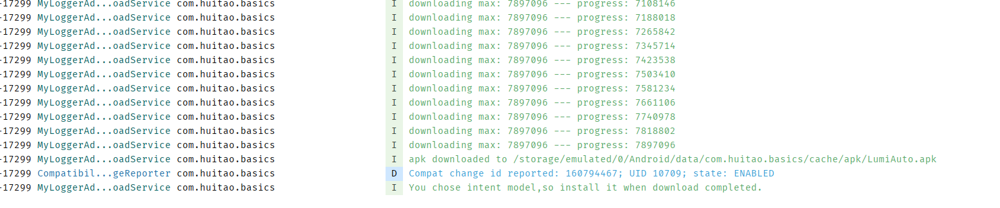

### 常用工具

### lib_update 使用说明

目前处于实验阶段：

Gradle 依赖:
```dsl
dependencies {
  compile 'com.atoto.libupdate:lib-update:1.0.0-SNAPSHOT'
}
```
执行示例



 具体使用
```kotlin
    DownloadManger.ConcreteBuilder(this)
            .apkUrl("https://atoto-usa.oss-us-west-1.aliyuncs.com/2024/FILE_UPLOAD_URL_2/64504783/LumiAuto_v1.0.0.12-release_2024-10-18.apk")
            .apkName("LumiAuto.apk")//文件名需要指定.apk结尾，下面有校验
            .downloadPath("${application.externalCacheDir?.path}/apk")//下载路径
            .smallIcon(R.mipmap.ic_launcher)//通知栏图标
            .logInterceptor(MyLoggerAdapter())//为了方便自己管理日志，比如写入文件可以传入自定义的
            .installationModel(InstallationModel.INTENT)//安装方式，SILENT 静默安装  INTENT 通过Intent安装需要人为干预
            .build()
            ?.download()
```
安装方式说明
```kotlin
@Retention(AnnotationRetention.SOURCE)
@IntDef(value = [InstallationModel.SILENT, InstallationModel.INTENT, InstallationModel.NOTHING])
annotation class InstallationModel {
    companion object {
        const val SILENT = 0 //静默安装
        const val INTENT = 1 //通过Intent安装 需要用户手动干预
        const val NOTHING = 2 //lib内部下载完成之后，不做任何处理，上层可以通过监听回调的方式自己进行业务处理
    }
}
```

如果需要在业务层监听下载状态，更新进度，可以使用DownloadManger.DownloadListener监听

接口定义

```kotlin
interface OnDownloadListener {

    fun onStart()

    fun onProgress(progress: Int, max: Int)

    fun onDone(file: File)

    fun onCancel()

    fun onError(e: Throwable)
}
```

设置监听

```kotlin
DownloadManger.ConcreteBuilder(this)
            .apkUrl("https://atoto-usa.oss-us-west-1.aliyuncs.com/2024/FILE_UPLOAD_URL_2/64504783/LumiAuto_v1.0.0.12-release_2024-10-18.apk")
            .apkName("LumiAuto.apk")//文件名需要指定.apk结尾，下面有校验
            .downloadPath("${application.externalCacheDir?.path}/apk")//下载路径
            .smallIcon(R.mipmap.ic_launcher)//通知栏图标
            .logInterceptor(MyLoggerAdapter())//为了方便自己管理日志，比如写入文件可以传入自定义的
            .installationModel(InstallationModel.INTENT)//安装方式，SILENT 静默安装  INTENT 通过Intent安装需要人为干预
            .onDownLoadListener(object : OnDownloadListener {
                override fun onStart() {

                }

                override fun onProgress(progress: Int, max: Int) {

                }

                override fun onDone(file: File) {

                }

                override fun onCancel() {

                }

                override fun onError(e: Throwable) {

                }
            })
            .build()
            ?.download()

```

#### 1，View防止重复点击

```kotlin
    //默认500ms
binding.root.clickNoRepeat {

}
```

```kotlin
//可自定义时间
binding.root.clickNoRepeat(interval = 500, action = {

})
```

#### 2,监听网络变化

实现： NetworkManager.NetworkHandler接口

初始化：

```kotlin
     //初始化
val networkHandler = NetworkManager(this, this)
val isOnline = networkHandler.isOnline
//开启监听
networkHandler.start()
//移除，防止内存泄漏
networkHandler.stop()
```
